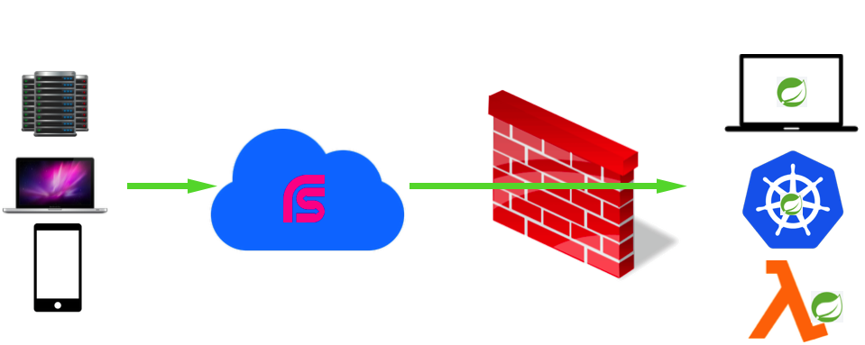

[](https://jitpack.io/#linux-china/open2internet-spring-boot-starter)

Open2Internet-spring-boot-starter
=================================

Expose your local Spring Boot(2.0+) Application to internet without any requirement, for example demonstration for customers, testing for callback from internet, mobile A/B testing etc.
You can test your application from anywhere, Kubernetes, Serverless, Lambda style etc without any Ops or modification required.



### Use cases

* Prototype demonstration for your customers.
* Interaction with your audiences during presentation, and you know your application runs on your laptop.
* Development debug if you develop applications connected with Wechat, facebook etc, and you know HTTP callback required from these platforms.
* You can expose your applications in Kubernetes for testing event without Ingress required.

### How to use

* Add open2internet dependencies

```xml
<dependency>
   <groupId>org.mvnsearch</groupId>
   <artifactId>open2internet-spring-boot-starter</artifactId>
   <version>1.1.0</version>
</dependency>
```

* Start your local Spring Boot application, and get hint from console.

```
open2internet by @linux_china

Connected Status              online
Management Token              dtie7of5
Internet Web Interface        https://19erktgk.microservices.club
Internet Web QR Code          https://api.qrserver.com/v1/create-qr-code/?size=150x150&data=https%3A%2F%2F19erktgk.microservices.club
Local Web Interface           http://127.0.0.1:58274
Forwarding Rule               https://19erktgk.microservices.club -> http://127.0.0.1:58274
```

* Click url of internet web interface for testing, or copy it to share with other guys. Or following Spring Boot endpoint:

```
curl http://127.0.0.1:8080/actuator/open2internet
```

### Connect or disconnect dynamically
For some reason, you disable open2internet during app start, and if you want to turn it on for testing, you can following ways.

* Disconnect
```
curl -H "Content-Type:application/json" -X POST -d '{}' http://127.0.0.1:8080/actuator/open2internet/disconnect

```

* Connect
```
curl -H "Content-Type:application/json" -X POST -d '{}' http://127.0.0.1:8080/actuator/open2internet/connect
```

### Q&A

* Https by default, and supplied by Let's Encrypt. You can use http also.
* You can customize your domain name permanently, for example appName.foobar.com, please contact me, just cname required.
* Tips: please share QR Code to your audiences during presentation.
* Why not ngrok? No env required, in Kubernetes, Serverless mode, Java friendly etc. You are developing Spring Boot application. Why not to make life easy? :beer:
* How to disable open2internet feature? Please add following on your application.properties.

```properties
open2internet.enable=false
```

### Todo

* Management console to replay HTTP requests.
* websocket support.
* Performance: no 127.0.0.1 http request.

### Thanks

I want to say thanks to [RSocket](http://rsocket.io) & [Reactor](https://projectreactor.io/), and I just write little code to implement this features, really true. :rose:

### References

* ngrok: https://ngrok.com/
* TryCloudflare: https://developers.cloudflare.com/argo-tunnel/learning/trycloudflare
* RSocket:  http://rsocket.io/
* RSocket Java: https://github.com/rsocket/rsocket-java
* Let's Encrypt: https://letsencrypt.org/
